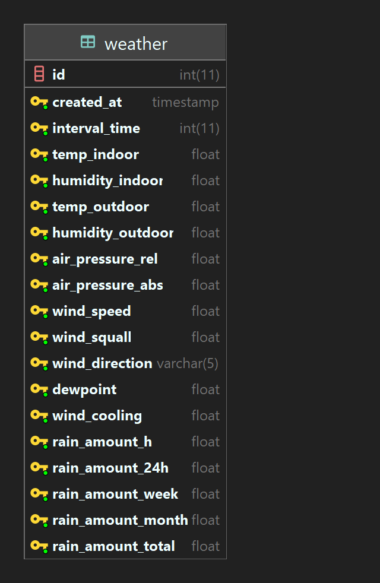

# vaderlek-starter
Beskriv vilka som skapat projektet

Beskriv vad projektet är för något

Beskriv hur man använder ert projekt

## Table of Contents
- [Installation]
  - Hosting requirements
  - Folder structure
  - Setting up database connection
  - Migrating
- Usage
  - [Endpoints](#endpoints)
- 
- [Database](#database)

## Endpoints
| Endpoint        | Protokoll | Beskrivning                         |
|-----------------|-----------|-------------------------------------|
| /               | GET       | Visar all väderdata                 |
| /latest/days/1  | GET       | Visar väderdata för senaste 1 dagarna |
| /secret/migrate | GET       | Migrera hela databasen              |

## Database
d



## Kodexempel

It only takes a few lines of code to get started:

```php
SimpleRouter::get('/', function() {
    return 'Hello world';
});
```


## Table of Contents

- [Getting started](#getting-started)
    - [Notes](#notes-1)
    - [Requirements](#requirements)
    - [Features](#features)
    - [Installation](#installation)
        - [Setting up Apache](#setting-up-apache)
        - [Setting up Nginx](#setting-up-nginx)
        - [Setting up IIS](#setting-up-iis)
        - [Configuration](#configuration)
        - [Helper functions](#helper-functions)
- [Routes](#routes)
    - [Basic routing](#basic-routing)
        - [Class hinting](#class-hinting)
        - [Available methods](#available-methods)
        - [Multiple HTTP-verbs](#multiple-http-verbs)
    - [Route parameters](#route-parameters)
        - [Required parameters](#required-parameters)
        - [Optional parameters](#optional-parameters)
        - [Regular expression constraints](#regular-expression-constraints)
        - [Regular expression route-match](#regular-expression-route-match)
        - [Custom regex for matching parameters](#custom-regex-for-matching-parameters)
    - [Named routes](#named-routes)
        - [Generating URLs To Named Routes](#generating-urls-to-named-routes)
    - [Router groups](#router-groups)
        - [Middleware](#middleware)
        - [Namespaces](#namespaces)
        - [Subdomain-routing](#subdomain-routing)
        - [Route prefixes](#route-prefixes)
    - [Partial groups](#partial-groups)
    - [Form Method Spoofing](#form-method-spoofing)
    - [Accessing The Current Route](#accessing-the-current-route)
    - [Other examples](#other-examples)
- [CSRF-protection](#csrf-protection)
    - [Adding CSRF-verifier](#adding-csrf-verifier)
    - [Getting CSRF-token](#getting-csrf-token)
    - [Custom CSRF-verifier](#custom-csrf-verifier)
    - [Custom Token-provider](#custom-token-provider)
- [Middlewares](#middlewares)
    - [Example](#example-1)
- [ExceptionHandlers](#exceptionhandlers)
    - [Handling 404, 403 and other errors](#handling-404-403-and-other-errors)
    - [Using custom exception handlers](#using-custom-exception-handlers)
        - [Prevent merge of parent exception-handlers](#prevent-merge-of-parent-exception-handlers)
- [Urls](#urls)
    - [Get the current url](#get-the-current-url)
    - [Get by name (single route)](#get-by-name-single-route)
    - [Get by name (controller route)](#get-by-name-controller-route)
    - [Get by class](#get-by-class)
    - [Using custom names for methods on a controller/resource route](#using-custom-names-for-methods-on-a-controllerresource-route)
    - [Getting REST/resource controller urls](#getting-restresource-controller-urls)
    - [Manipulating url](#manipulating-url)
    - [Useful url tricks](#useful-url-tricks)
- [Input & parameters](#input--parameters)
    - [Using the Input class to manage parameters](#using-the-input-class-to-manage-parameters)
        - [Get single parameter value](#get-single-parameter-value)
        - [Get parameter object](#get-parameter-object)
        - [Managing files](#managing-files)
        - [Get all parameters](#get-all-parameters)
        - [Check if parameters exists](#check-if-parameters-exists)
- [Events](#events)
    - [Available events](#available-events)
    - [Registering new event](#registering-new-event)
    - [Custom EventHandlers](#custom-eventhandlers)
- [Advanced](#advanced)
    - [Disable multiple route rendering](#disable-multiple-route-rendering)
    - [Restrict access to IP](#restrict-access-to-ip)
    - [Setting custom base path](#setting-custom-base-path)
    - [Url rewriting](#url-rewriting)
        - [Changing current route](#changing-current-route)
        - [Bootmanager: loading routes dynamically](#bootmanager-loading-routes-dynamically)
        - [Adding routes manually](#adding-routes-manually)
    - [Custom class-loader](#custom-class-loader)
        - [Integrating with php-di](#Integrating-with-php-di)
    - [Parameters](#parameters)
    - [Extending](#extending)
- [Help and support](#help-and-support)
    - [Common issues and fixes](#common-issues-and-fixes)
        - [Multiple routes matches? Which one has the priority?](#multiple-routes-matches-which-one-has-the-priority)
        - [Parameters won't match or route not working with special characters](#parameters-wont-match-or-route-not-working-with-special-characters)
        - [Using the router on sub-paths](#using-the-router-on-sub-paths)
    - [Debugging](#debugging)
        - [Creating unit-tests](#creating-unit-tests)
        - [Debug information](#debug-information)
        - [Benchmark and log-info](#benchmark-and-log-info)
    - [Reporting a new issue](#reporting-a-new-issue)
        - [Procedure for reporting a new issue](#procedure-for-reporting-a-new-issue)
        - [Issue template](#issue-template)
    - [Feedback and development](#feedback-and-development)
        - [Contribution development guidelines](#contribution-development-guidelines)
- [Credits](#credits)
    - [Sites](#sites)
    - [License](#license)

___

# Getting started

Add the latest version of the simple-router project running this command.

```
composer require pecee/simple-router
```

## Notes

The goal of this project is to create a router that is more or less 100% compatible with the Laravel documentation, while remaining as simple as possible, and as easy to integrate and change without compromising either speed or complexity. Being lightweight is the #1 priority.

We've included a simple demo project for the router which can be found [here](https://github.com/skipperbent/simple-router-demo). This project should give you a basic understanding of how to setup and use simple-php-router project.

Please note that the demo-project only covers how to integrate the `simple-php-router` in a project without an existing framework. If you are using a framework in your project, the implementation might vary.

You can find the demo-project here: [https://github.com/skipperbent/simple-router-demo](https://github.com/skipperbent/simple-router-demo)

**What we won't cover:**

- How to setup a solution that fits your need. This is a basic demo to help you get started.
- Understanding of MVC; including Controllers, Middlewares or ExceptionHandlers.
- How to integrate into third party frameworks.

**What we cover:**

- How to get up and running fast - from scratch.
- How to get ExceptionHandlers, Middlewares and Controllers working.
- How to setup your webservers.

## Requirements

- PHP 7.1 or greater (version 3.x and below supports PHP 5.5+)
- PHP JSON extension enabled.

## Features

- Basic routing (`GET`, `POST`, `PUT`, `PATCH`, `UPDATE`, `DELETE`) with support for custom multiple verbs.
- Regular Expression Constraints for parameters.
- Named routes.
- Generating url to routes.
- Route groups.
- Middleware (classes that intercepts before the route is rendered).
- Namespaces.
- Route prefixes.
- CSRF protection.
- Optional parameters
- Sub-domain routing
- Custom boot managers to rewrite urls to "nicer" ones.
- Input manager; easily manage `GET`, `POST` and `FILE` values.
- IP based restrictions.
- Easily extendable.

## Installation

1. Navigate to your project folder in terminal and run the following command:

```php
composer require pecee/simple-router
```
